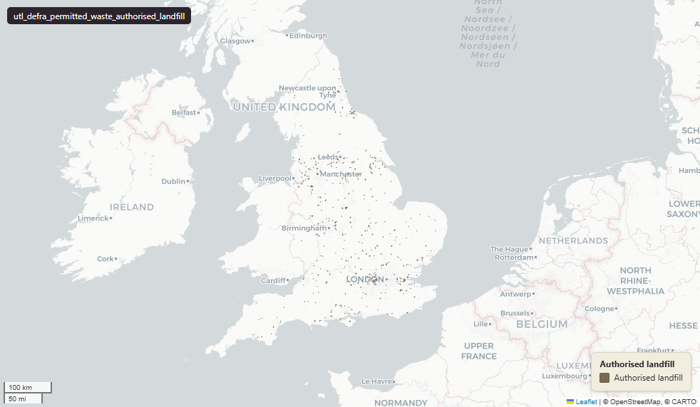

# Defra - Department for Environment, Food and Rural Affairs — Environment Agency Permitted Waste Sites, Authorised Landfill Site Boundaries (England)

Permitted Waste Authorised Landfill

`utl_defra_permitted_waste_authorised_landfill`

**SOURCE**

- Environment Agency (EA), part of the Department for Environment, Food and Rural Affairs (Defra). Permitted Waste Sites - Authorised Landfill Site Boundaries dataset.

**DOCUMENTATION**

- EA dataset record : https://environment.data.gov.uk/dataset/692eaecf-d465-11e4-ac2e-f0def148f590

**DEFINITIONS**

- "The Permitted Waste Sites - Authorised Landfill Site Boundaries is a polygon dataset that contains the boundaries of landfill sites that are currently authorised by the Environment Agency under Environmental Permitting Regulations." (Environment Agency)

**SCOPE**

- England. 2,406 rows.

**CRS**

- EPSG:27700 (OSGB 1936 / British National Grid). Geometry type Polygon.

**LICENCE**

- Open Government Licence v3.0. © Environment Agency.

**ENRICHMENT**

- `msoa21hclnm` — House of Commons Library readable MSOA name, assigned at load via the polygon's 2021 MSOA (representative interior point in uk_baseline.adm_ons_msoa_boundary_2021). Open Parliament Licence.

MSOA SPLIT (added 30 June 2026)

- Geometry split to one row per (source feature x MSOA 2021). Each row carries that MSOA's msoa21cd / msoa21nm / msoa21hclnm and best-fit lad22 / lad25. The source feature's original primary key is preserved as `source_fid`; `gid` is a fresh surrogate primary key.
- Features lying within a single MSOA are kept whole (one row, primary-tagged); only features spanning more than one MSOA are split into per-MSOA pieces.

## Columns

| Column | Type | Description / unit |
|---|---|---|
| `lic_admin` | `character varying` |  |
| `lic_nmbr` | `character varying` |  |
| `lic_ippcr` | `character varying` |  |
| `lic_wml` | `double precision` |  |
| `cust_nmbr` | `character varying` |  |
| `status` | `character varying` |  |
| `lic_ltype` | `character varying` |  |
| `lic_name` | `character varying` |  |
| `lic_site` | `character varying` |  |
| `site_name` | `character varying` |  |
| `site_build` | `character varying` |  |
| `site_strt` | `character varying` |  |
| `site_area` | `character varying` |  |
| `site_town` | `character varying` |  |
| `site_cnty` | `character varying` |  |
| `site_pcode` | `character varying` |  |
| `type_desc` | `character varying` |  |
| `ngr` | `character varying` |  |
| `ctroid_x` | `integer` |  |
| `ctroid_y` | `integer` |  |
| `area` | `character varying` |  |
| `date_issue` | `timestamp without time zone` |  |
| `lic_epr` | `character varying` |  |
| `gdb_geomattr_data` | `character varying` |  |
| `id_original` | `character varying` |  |
| `wd21nm` | `character varying` |  |
| `wd21cd` | `character varying` |  |
| `area_ha` | `double precision` |  |
| `fid` | `bigint` |  |
| `msoa21cd` | `text` | Middle Layer Super Output Area (MSOA) 2021 code of this piece. Open Government Licence v3.0. |
| `msoa21nm` | `text` | Official ONS MSOA 2021 name of this piece. Open Government Licence v3.0. |
| `msoa21hclnm` | `text` | House of Commons Library readable MSOA name of this piece. Open Parliament Licence. |
| `lad22cd` | `character varying` | Local Authority District 2022 code (2021 LAD geography, anchored to the MSOA 2021 name scoping), best-fit from this piece's msoa21cd. Open Government Licence v3.0. |
| `lad22nm` | `character varying` | Local Authority District 2022 name (2021 LAD geography), best-fit from this piece's msoa21cd. Open Government Licence v3.0. |
| `lad25cd` | `text` | Local Authority District 2025 code (current administering authority), best-fit from this piece's msoa21cd. Open Government Licence v3.0. |
| `lad25nm` | `text` | Local Authority District 2025 name (current administering authority), best-fit from this piece's msoa21cd. Open Government Licence v3.0. |
| `geom` | `geometry(MultiPolygon,27700)` |  |
| `source_fid` | `bigint` | Primary key of the source feature in the pre-split layer uk.utl_defra_permitted_waste_authorised_landfill__preswap_jun30 (non-unique here: a feature spanning N MSOAs has N rows). |
| `gid` | `bigint` |  |
