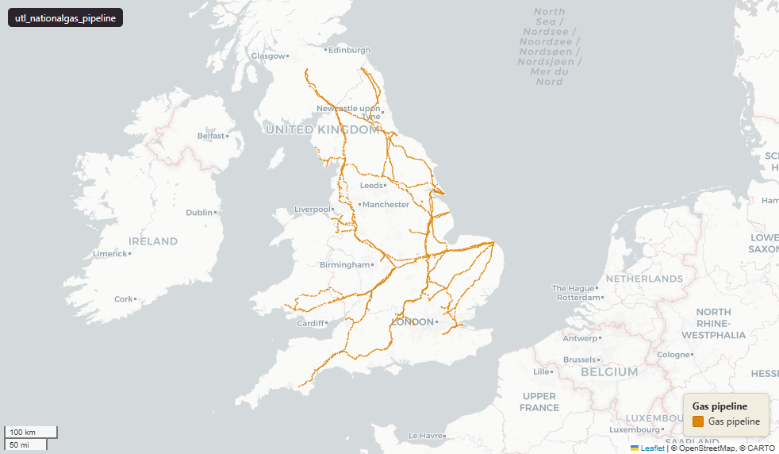

# National Gas - National Transmission System (NTS) gas transmission pipelines, Great Britain

Pipeline

`utl_nationalgas_pipeline`

**SOURCE**

- National Gas (formerly National Grid Gas). National Transmission System pipeline network.

**DOCUMENTATION**

- National Gas network and assets : https://www.nationalgas.com/our-businesses/our-network-and-assets

**DEFINITIONS**

- National Gas Transmission owns and operates Britain's National Transmission System (NTS) for gas; the NTS consists of nearly 5,000 miles of high-pressure steel pipes and more than 500 above-ground installations. (National Gas)

**SCOPE**

- Great Britain. 3,175 rows.

**CRS**

- EPSG:27700 (OSGB 1936 / British National Grid). Geometry type Polygon.

**LICENCE**

- © National Gas. Licence - confirm with National Gas before re-publication.

MSOA SPLIT (added 3 July 2026)

- Geometry split to one row per (source feature x MSOA 2021). Each row carries that MSOA's msoa21cd / msoa21nm / msoa21hclnm and best-fit lad22 / lad25. The source feature's original primary key is preserved as `source_fid`; `gid` is a fresh surrogate primary key. Features with no MSOA overlap (offshore or outside England & Wales) are kept whole with NULL geography columns.
- Keep-everything (3 July 2026): geometry outside every MSOA — offshore, estuarine, or beyond the generalised coastline — is retained as rows with NULL geography columns (source_fid links the parts), so the layer holds the complete source geometry.

## Columns

| Column | Type | Description / unit |
|---|---|---|
| `source_fid` | `bigint` | Primary key of the source feature in the pre-split layer uk.utl_nationalgas_pipeline__preswap_jul03 (non-unique here: a feature spanning N MSOAs has N rows). |
| `actualinte` | `double precision` |  |
| `owner` | `character varying(3)` |  |
| `pipegrade` | `character varying(15)` |  |
| `inserviced` | `date` |  |
| `pipe_name` | `character varying(100)` |  |
| `featureid` | `double precision` |  |
| `shape_leng` | `double precision` |  |
| `id_original` | `integer` |  |
| `wd21nm` | `character varying` |  |
| `wd21cd` | `character varying` |  |
| `area_ha` | `double precision` |  |
| `fid` | `bigint` |  |
| `msoa21cd` | `character varying` | Middle Layer Super Output Area (MSOA) 2021 code of this piece. Open Government Licence v3.0. |
| `msoa21nm` | `character varying` | Official ONS MSOA 2021 name of this piece. Open Government Licence v3.0. |
| `msoa21hclnm` | `text` | House of Commons Library readable MSOA name of this piece. Open Parliament Licence. |
| `lad22cd` | `text` | Local Authority District 2022 code (2021 LAD geography, anchored to the MSOA 2021 name scoping), best-fit from this piece's msoa21cd. Open Government Licence v3.0. |
| `lad22nm` | `text` | Local Authority District 2022 name (2021 LAD geography), best-fit from this piece's msoa21cd. Open Government Licence v3.0. |
| `lad25cd` | `text` | Local Authority District 2025 code (current administering authority), best-fit from this piece's msoa21cd. Open Government Licence v3.0. |
| `lad25nm` | `text` | Local Authority District 2025 name (current administering authority), best-fit from this piece's msoa21cd. Open Government Licence v3.0. |
| `geom` | `geometry(MultiPolygon,27700)` |  |
| `gid` | `bigint` |  |
