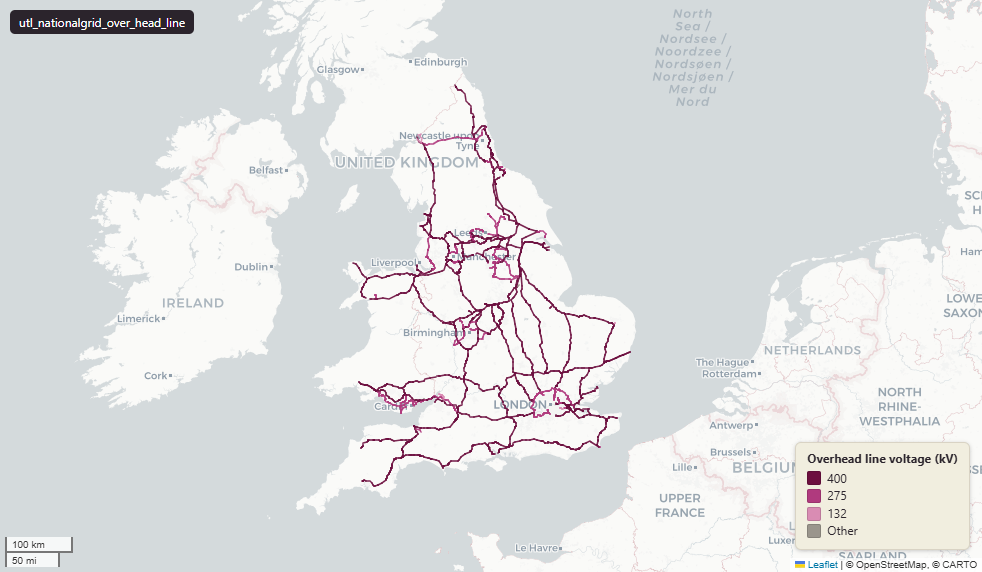

# National Grid Electricity Transmission - overhead lines, England and Wales

Over Head Line

`utl_nationalgrid_over_head_line`

**SOURCE**

- National Grid Electricity Transmission. High-voltage transmission overhead line assets.

**DOCUMENTATION**

- National Grid Electricity Transmission : https://www.nationalgrid.com/electricity-transmission

**DEFINITIONS**

- An overhead transmission line transmits power from the generating source into the national grid network, and on to substations that provide power to homes and businesses. (National Grid)

**SCOPE**

- England and Wales. 3,780 rows.

**CRS**

- EPSG:27700 (OSGB 1936 / British National Grid). Geometry type LineString.

**LICENCE**

- © National Grid. Licence - confirm with National Grid before re-publication.

MSOA SPLIT (added 4 July 2026)

- Geometry split to one row per (source feature x MSOA 2021). Each row carries that MSOA's msoa21cd / msoa21nm / msoa21hclnm and best-fit lad22 / lad25. The source feature's original primary key is preserved as `source_fid`; `gid` is a fresh surrogate primary key. Geometry outside every MSOA (offshore or outside England & Wales) is retained as rows with NULL geography columns, so the layer holds the complete source geometry.

## Columns

| Column | Type | Description / unit |
|---|---|---|
| `source_fid` | `bigint` | Primary key of the source feature in the pre-split layer uk.utl_nationalgrid_over_head_line__preswap_jul04 (non-unique here: a feature spanning N MSOAs has N rows). |
| `gdo_gid` | `numeric` |  |
| `route_asse` | `character varying(12)` |  |
| `towers_in` | `character varying(40)` |  |
| `action_dtt` | `date` |  |
| `status` | `character varying(1)` |  |
| `operating_` | `character varying(18)` |  |
| `circuit1` | `character varying(200)` |  |
| `circuit2` | `character varying(200)` |  |
| `id_original` | `integer` |  |
| `wd21nm` | `character varying` |  |
| `wd21cd` | `character varying` |  |
| `length_m` | `double precision` |  |
| `msoa21cd` | `character varying` | Middle Layer Super Output Area (MSOA) 2021 code of this piece. Open Government Licence v3.0. |
| `msoa21nm` | `character varying` | Official ONS MSOA 2021 name of this piece. Open Government Licence v3.0. |
| `msoa21hclnm` | `text` | House of Commons Library readable MSOA name of this piece. Open Parliament Licence. |
| `lad22cd` | `text` | Local Authority District 2022 code (2021 LAD geography, anchored to the MSOA 2021 name scoping), best-fit from this piece's msoa21cd. Open Government Licence v3.0. |
| `lad22nm` | `text` | Local Authority District 2022 name (2021 LAD geography), best-fit from this piece's msoa21cd. Open Government Licence v3.0. |
| `lad25cd` | `text` | Local Authority District 2025 code (current administering authority), best-fit from this piece's msoa21cd. Open Government Licence v3.0. |
| `lad25nm` | `text` | Local Authority District 2025 name (current administering authority), best-fit from this piece's msoa21cd. Open Government Licence v3.0. |
| `geom` | `geometry(MultiLineString,27700)` |  |
| `gid` | `bigint` |  |
