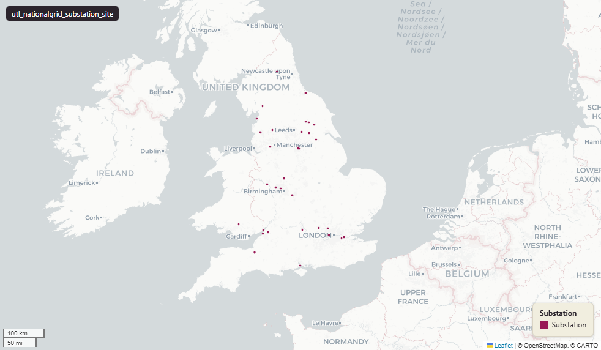

# National Grid Electricity Transmission - substation sites, England and Wales

Substation Site

`utl_nationalgrid_substation_site`

**SOURCE**

- National Grid Electricity Transmission. High-voltage transmission substation site assets.

**DOCUMENTATION**

- National Grid Electricity Transmission : https://www.nationalgrid.com/electricity-transmission

**DEFINITIONS**

- Substations connect sources of electricity generation to the transmission network and onward to the distribution system that reaches homes and businesses; this layer represents National Grid substation sites. (National Grid)

**SCOPE**

- England and Wales. 505 rows.

**CRS**

- EPSG:27700 (OSGB 1936 / British National Grid). Geometry type Polygon.

**LICENCE**

- © National Grid. Licence - confirm with National Grid before re-publication.

**ENRICHMENT**

- `msoa21hclnm` — House of Commons Library readable MSOA name, assigned at load via the polygon's 2021 MSOA (representative interior point in uk_baseline.adm_ons_msoa_boundary_2021). Open Parliament Licence.

MSOA SPLIT (added 30 June 2026)

- Geometry split to one row per (source feature x MSOA 2021). Each row carries that MSOA's msoa21cd / msoa21nm / msoa21hclnm and best-fit lad22 / lad25. The source feature's original primary key is preserved as `source_fid`; `gid` is a fresh surrogate primary key.
- Features lying within a single MSOA are kept whole (one row, primary-tagged); only features spanning more than one MSOA are split into per-MSOA pieces.

## Columns

| Column | Type | Description / unit |
|---|---|---|
| `substation` | `character varying(100)` |  |
| `operating_` | `character varying(100)` |  |
| `action_dtt` | `date` |  |
| `status` | `character varying(1)` |  |
| `substati_1` | `character varying(200)` |  |
| `owner_flag` | `character varying(1)` |  |
| `gdo_gid` | `numeric` |  |
| `id_original` | `integer` |  |
| `wd21nm` | `character varying` |  |
| `wd21cd` | `character varying` |  |
| `area_ha` | `double precision` |  |
| `msoa21cd` | `text` | Middle Layer Super Output Area (MSOA) 2021 code of this piece. Open Government Licence v3.0. |
| `msoa21nm` | `text` | Official ONS MSOA 2021 name of this piece. Open Government Licence v3.0. |
| `msoa21hclnm` | `text` | House of Commons Library readable MSOA name of this piece. Open Parliament Licence. |
| `lad22cd` | `character varying` | Local Authority District 2022 code (2021 LAD geography, anchored to the MSOA 2021 name scoping), best-fit from this piece's msoa21cd. Open Government Licence v3.0. |
| `lad22nm` | `character varying` | Local Authority District 2022 name (2021 LAD geography), best-fit from this piece's msoa21cd. Open Government Licence v3.0. |
| `lad25cd` | `text` | Local Authority District 2025 code (current administering authority), best-fit from this piece's msoa21cd. Open Government Licence v3.0. |
| `lad25nm` | `text` | Local Authority District 2025 name (current administering authority), best-fit from this piece's msoa21cd. Open Government Licence v3.0. |
| `geom` | `geometry(MultiPolygon,27700)` |  |
| `source_fid` | `bigint` | Primary key of the source feature in the pre-split layer uk.utl_nationalgrid_substation_site__preswap_jun30 (non-unique here: a feature spanning N MSOAs has N rows). |
| `gid` | `bigint` |  |
