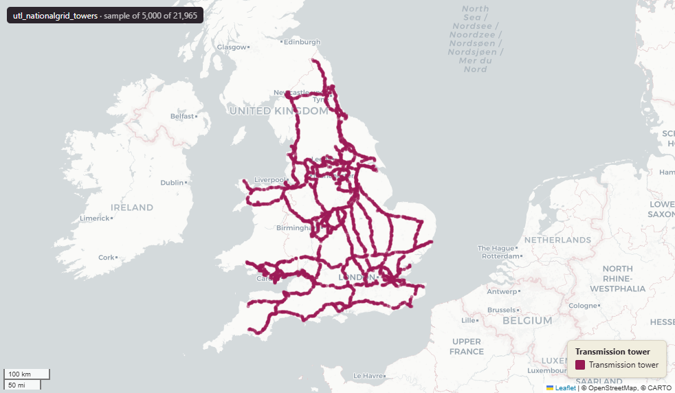

# National Grid Electricity Transmission - transmission towers (pylons), England and Wales

Towers

`utl_nationalgrid_towers`

**SOURCE**

- National Grid Electricity Transmission. High-voltage transmission tower (pylon) assets.

**DOCUMENTATION**

- National Grid Electricity Transmission : https://www.nationalgrid.com/electricity-transmission

**DEFINITIONS**

- Transmission towers (pylons) are the steel lattice structures that carry National Grid high-voltage overhead lines. (National Grid)

**SCOPE**

- England and Wales. 21,965 rows.

**CRS**

- EPSG:27700 (OSGB 1936 / British National Grid). Geometry type Point.

**LICENCE**

- © National Grid. Licence - confirm with National Grid before re-publication.

## Columns

| Column | Type | Description / unit |
|---|---|---|
| `tower_asse` | `character varying(12)` | Source field "tower_asse"; tower asset reference (name truncated). |
| `action_dtt` | `date` | Source field "action_dtt"; action date (name truncated). |
| `status` | `character varying(1)` | Source field "status"; source status code. |
| `line_serie` | `character varying(200)` | Source field "line_serie"; line series (name truncated). |
| `tower_cons` | `character varying(30)` | Source field "tower_cons"; tower construction type. Observed values: "D", "D30", "D60", "D10". |
| `year_of_in` | `integer` | Source field "year_of_in"; year installed (name truncated). |
| `tower_heig` | `double precision` | Source field "tower_heig"; tower height (name truncated). |
| `gdo_gid` | `numeric` | Source field "gdo_gid"; source feature identifier. |
| `id_original` | `integer` | Original feature id preserved at load. |
| `lad22nm` | `character varying` | Local Authority District 2022 name (2021 LAD geography). Assigned at load by point-in-polygon location against uk_baseline.adm_ons_lad_boundary_may2022. Open Government Licence v3.0. |
| `lad22cd` | `character varying` | Local Authority District 2022 code (2021 LAD geography, anchored to the MSOA 2021 name scoping). Assigned at load by point-in-polygon location against uk_baseline.adm_ons_lad_boundary_may2022. Open Government Licence v3.0. |
| `wd21nm` | `character varying` | Joined at load from ONS Ward 2021 lookup; 2021 Ward name. |
| `wd21cd` | `character varying` | Joined at load from ONS Ward 2021 lookup; 2021 Ward GSS code. |
| `geom` | `geometry(Point,27700)` | Point in EPSG:27700. Transmission tower (pylon) point. |
| `fid` | `bigint` |  |
| `msoa21cd` | `text` | Middle Layer Super Output Area (MSOA) 2021 code. Assigned at load by point-in-polygon location against uk_baseline.adm_ons_msoa_boundary_2021. Open Government Licence v3.0. |
| `msoa21nm` | `text` | Official ONS Middle Layer Super Output Area 2021 name. Assigned at load via the point's 2021 MSOA (point-in-polygon against uk_baseline.adm_ons_msoa_boundary_2021). Open Government Licence v3.0. |
| `msoa21hclnm` | `text` | House of Commons Library readable MSOA name. Assigned at load via the point's 2021 MSOA (point-in-polygon against uk_baseline.adm_ons_msoa_boundary_2021, which carries the House of Commons Library name). Open Parliament Licence. |
| `lad25cd` | `text` | Local Authority District 2025 code (current administering authority). Assigned at load by point-in-polygon location against uk_baseline.adm_ons_lad_boundary_may2025. Open Government Licence v3.0. |
| `lad25nm` | `text` | Local Authority District 2025 name (current administering authority). Assigned at load by point-in-polygon location against uk_baseline.adm_ons_lad_boundary_may2025. Open Government Licence v3.0. |
